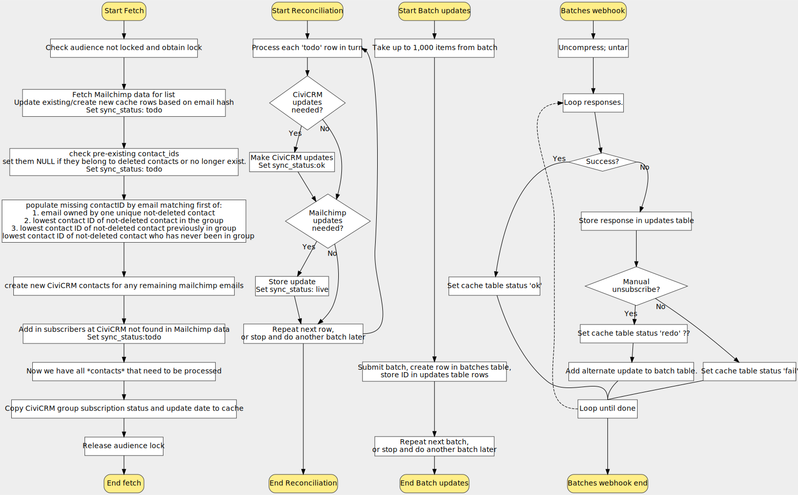

# How the sync processes work

1. A frequently run incremental sync. This process checks for changes made
   since the last sync, and processes them.

2. Immediate sync for a single contact **when a record is changed on Mailchimp**,
   it should fire a webhook to tell CiviCRM about the changes. CiviCRM can then
   immediately sync that contact. Mailchimp does not fire these webhooks for
   every type of update, so this alone is not enough.

3. Data sync. (todo) Updates any data generated by CiviCRM that is to be stored
   in Mailchimp also.

The main incremental sync process is supposed to be run frequently and
regularly. How often is up to you, could be every 5 minutes or every hour.
There are parts to this:

1. **Fetch and reconcile**: When a sync is started a process fetches
   information from Mailchimp and CiviCRM and updates a local subscribers cache
   table. Next begins a reconciliation algorithm which compares it and decides
   which service should be considered correct. Updates to CiviCRM are made
   directly. Updates to Mailchimp are submitted to Mailchimp in batches of up
   to 1,000 per batch and we then have to wait for them to finish processing
   these.

2. **Batch result handler**: A Mailchimp Batch Update Webhook causes the result
   of a batch to be fetched (from Mailchimp) and inspected. Unsusccessful
   updates that were due to us trying to subscribe someone who previously
   unsubscribed result in a new update job to set their status to
   'pending'. Other failures are just logged.

!!! danger
    This diagram needs updating.

# How webhooks are handled {: #webhooks }

We handle unsubscribes, subscribes, cleaned, profile and email update webhooks.

**Unsubscribes and cleaned** result in the contact being removed from the
group. If **cleaned** then also the email is put "on hold".

**Profile updates** will result in the name fields being changed in CiviCRM, if
the updated data contains `FNAME` or `LNAME` merge fields.

**Email updates** are handled as follows:

- If the incoming email is not already found on the contact record, a new Bulk
  Email is added. If we know this email already belongs to the contact, no
  changes are made to it.

- The `civicrm_mailchimpsync_cache` row has its `mailchimp_email` updated to the new one.

- Note that the old email is **not** deleted or put on hold; it's perfectly
  normal for someone to change an address they have on a list for a new one but
  keep their other one(s) for other purposes (different lists, or billing etc.)

!!! note
    Email updates CiviCRM → Mailchimp: see [Issue #4](https://lab.civicrm.org/extensions/mailchimpsync/issues/4). Unsure about name updates C→M.

