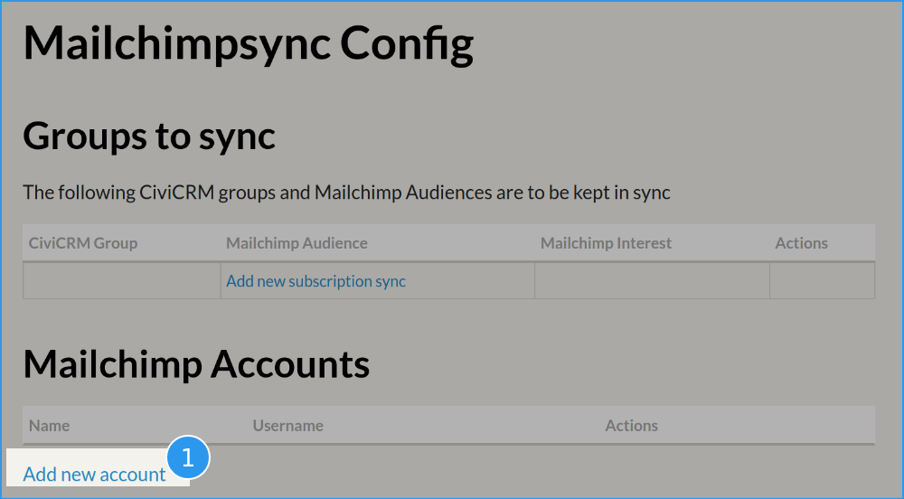
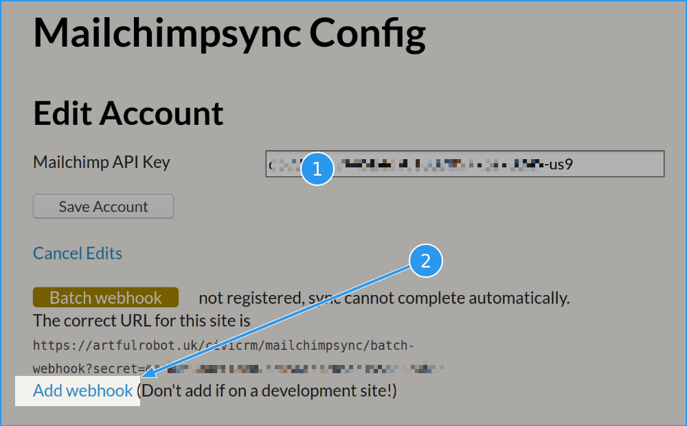
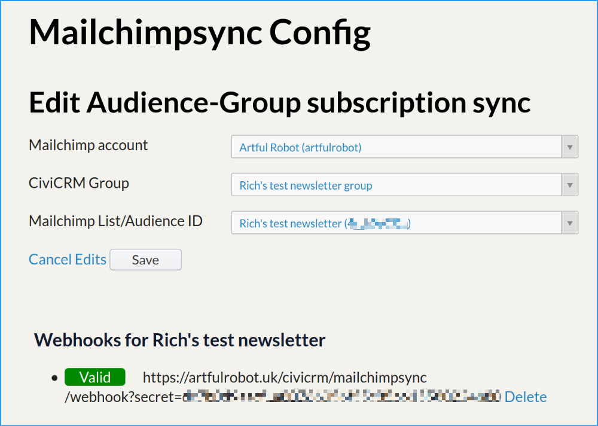
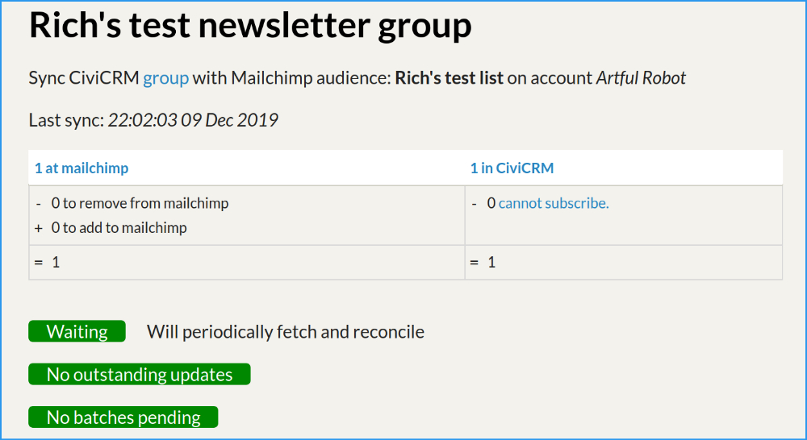

This tutorial will guide you through getting a new CiviCRM list linked up with a new Mailchimp audience, and seeing how the sync works. Before you start you'll need to have installed this extension in the normal way.

## Step 1: prepare a Mailchimp Audience

Login to your Mailchimp account. We need a Mailchimp audience (audiences used to be called *lists*) to work with.

If you have a paid account, you can create a new audience. If you have a free account you're only allowed one "Audience", so you might want to set up a new free account for the purposes of following this tutorial.

Make a note of the audience's *name*. Mine's called *Rich's test newsletter*.

Check the "Merge Fields". If you want to use *Dear Wilma,* in your emails for example, you'll need to add two **non-required** text fields, one called `FNAME` (for first name) and one called `LNAME` (last name). See [FAQ](discussion/faq.md#mergefields).

## Step 2: create a Mailchimp API key

Still on Mailchimp's website, you need to find the page that lets you add a [Mailchimp API Key](https://mailchimp.com/help/about-api-keys/ "Link to Mailchimp help article explaining what these are"). At the time of writing, this is found as follows:

Visit the **Account** page, then under the **Extras** is **API Keys**. Click **Create a key**.

Copy the API key you just created. It is a code that looks like
`d41d8cd98f00b204e9800998ecf8427e-us9` - we'll need to set this up in CiviCRM so that the two systems can talk to eachother

## Step 3: create a CiviCRM mailing group

Log in to your CiviCRM site and create a new group.

**Contacts » New Group**

I'm calling mine *Rich's test newsletter recipients*. Remember to tick the **Mailing List** option. Click **Save**

## Step 4: link your Mailchimp account

Visit **Administer » System Settings » Configure Mailchimp Sync**.

Click ❶ **Add new account** and enter your Mailchimp API Key and
click **Save Account**.

There will be a pause while information is fetched from Mailchimp. If your API key was entered correctly, you should see something like this:

There's a warning about a missing "Batch webhook". Fix this by clicking the **Add webhook** link and after a pause the screen should update to say: "Batch webhook correctly registered".

Now press **Save Account** again and you should now be back at the main configuration screen.

## Step 5: Link your audience in Mailchimp to your group in CiviCRM

Click the **Add new subscription sync** link.

Choose your Mailchimp account, Mailchimp audience and CiviCRM group from the drop-downs. Again, you'll see a warning about a missing webhook, and again just click the **Create webhook** link and it should now all be ready like this:

Click **Save** to save your configuration and you should now see something like this:

!!! success "Congratulations!"
    You've done the hard bit, and it should be ready and working. Carry on with the tutorial to test it out.

## Step 6: Check out the status page

Visit **Mailings » Mailchimp Sync Status**. It should show your sync connection as Not In Sync because no sync has been run yet:

!!! note
    If yours says *In Sync* instead of *Not In Sync*, don't worry, that's fine, it means your scheduled job has just run and so it's now in sync.

## Step 7: Add a contact

Find a contact (e.g. yourself) in CiviCRM and add them to your test newsletter group in any of the normal CiviCRM ways.

If you're making up a test contact for this purpose, remember that they will need a real and valid email address - Mailchimp doesn't allow dummy ones!

## Step 8: Start a sync run

Normally the sync runs hourly, but that's going to make the tutorial take quite a while! But you can force it to run a sync whenever you want, so let's do this now:

1. Go to **Administer » System Settings » Scheduled Jobs**

2. Find the job called **Call Mailchimpsync.Fetchandreconcile**

3. In the **actions** column, click the **more » Execute Now**

## Step 9: monitor the status page

Navigate back to the status page at **Mailings » Mailchimp sync status**. This time, click the name of your list to see some extra details like this:

The sync process goes through many steps, so when you first get here it might not have reached In Sync status yet. You can keep hitting the **Refresh** button if you like, you should get to a screen like the above.

You'll see the table is balanced: 1 at Mailchimp, 1 at CiviCRM.

The three green status messages mean everything is at rest.

!!! note
    If you got to this page quickly after running the sync job then it's likely that you caught the third status indicator as amber, and you may have seen it say something like *Mailchimp updates complete, waiting to check.* This is normal; we send changes to Mailchimp in batches and it tells us when they've finished (using that "Batch Webhook" you set up earlier). Sometimes it takes it a few minutes to send these. But hopefully you hit Refresh after a while and saw it go green as shown.

So now the contact you added has been added at Mailchimp. Hooray. You can check that by logging into Mailchimp, if you like.

## Step 10: remove the contact from the group

Go back to your contact in CiviCRM and **remove** them from your test newsletter group.

Then go back to the status page - note it says *Not In Sync*, and click on your list to get to the detailed page as in the last screenshot. It should now show:

- *1 at Mailchimp*: that's the count from the last sync run, so it's not changed yet.
- *-1 to remove from Mailchimp*: it's showing you that we need to remove a contact from Mailchimp.
- *=0* at the bottom shows that this will result in the numbers at Mailchimp balancing CiviCRM's version again.

The three status indicators are still all green; they're only not green when something is happening, and at the moment we're just waiting for the next sync operation to begin.

## Step 11: meanwhile, add a new contact at Mailchimp

Log in to your Mailchimp account, find your audience and add a (different) subscriber.

Now go back to the status page in CiviCRM. And click **Refresh**. With a bit of luck you'll see the numbers have changed:

- *2 at Mailchimp*: this is because you added one!
- *-1 to remove from Mailchimp*: this still hasn't happened yet,
- *=1* at the bottom shows we're expecting one subscriber once we're all done.

And on the right side:

- *1 at CiviCRM*: the new subscriber you added has been added to the group (and added as a contact if they weren't already a contact).

!!! question
    You're probably wondering why it's super fast from Mailchimp to CiviCRM while the other direction has to wait for syncs to run. This tutorial isn't the place to explain in detail, but basically the changes are usually smaller coming from Mailchimp to CiviCRM so it's feasible to handle them in this way.

!!! success "Congratulations!"
    You've completed this tutorial. If all has gone well, you've now got a fully functional two-way sync set up between your group and your audience. You may now want to look at the How To pages to plan implementing this on existing audiences/groups, learn how to use Interest Groups, or (if you're a developer) how to pump more data up to Mailchimp, like the person's current membership details.

