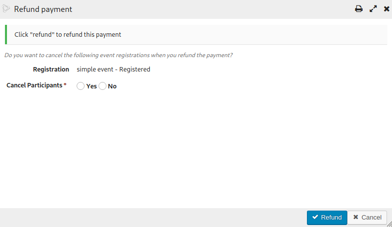
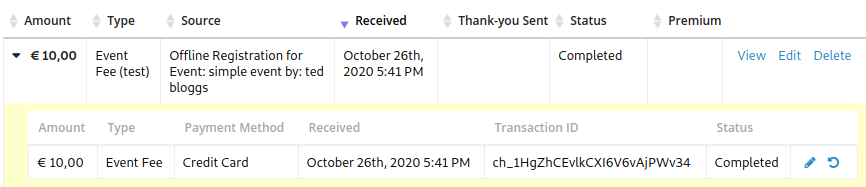

# Refunds UI (experimental)

There is a refunds UI available for payments:

To access the refund click the "undo" icon by the payment:

Currently it can be enabled via the setting `mjwshared_refundpaymentui` which is available via
*Administer->CiviContribute->Stripe Settings: Enable refund payment via UI (experimental)?*

It allows you to issue refunds for `Completed` payments if the payment processor supports it (eg. Stripe).

It also allows you to choose whether to cancel the event registration if there are any linked to the contribution (via line-items).

To access the refunds UI you must have "edit contributions" permission.
